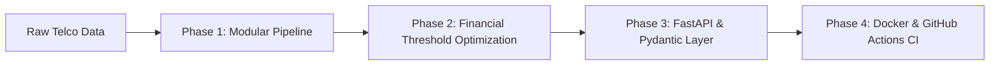
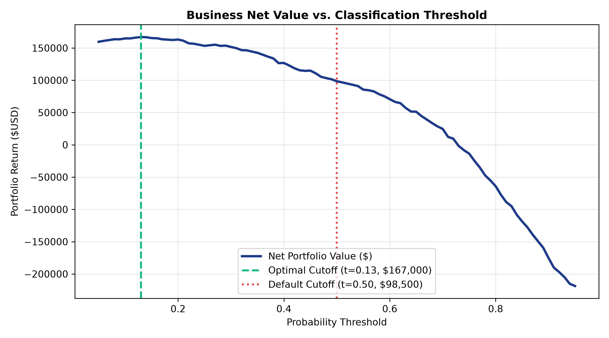

# Customer Churn Prediction — Production MLOps System

[](https://www.python.org/)
[](https://fastapi.tiangolo.com/)
[](Dockerfile)
[](.github/workflows/ci.yml)
[](tests/)
[](https://github.com/astral-sh/ruff)
[](https://scikit-learn.org/)
[](LICENSE)

An end-to-end, production-grade supervised machine learning system engineered to forecast customer attrition ("churn") for subscription telecommunications services. Built using leak-proof preprocessing pipelines, 5-fold stratified cross-validation, financial threshold optimization (+**$146,250 net portfolio value** over naive 0.50 cutoff), a FastAPI REST inference microservice with Pydantic v2 schemas, automated multi-stage Docker containerization, and a GitHub Actions CI pipeline.

---

## 📑 Table of Contents
1. [Production MLOps Engineering (4-Phase Architecture)](#-production-mlops-engineering-4-phase-architecture)
   - [Phase 1: Modular ML Pipeline](#phase-1-modular-ml-pipeline-srctrainpy)
   - [Phase 2: Financial Threshold Optimization](#phase-2-financial-threshold-optimization-srcevaluatepy)
   - [Phase 3: FastAPI & Pydantic Serving Layer](#phase-3-fastapi--pydantic-serving-layer-appmainpy-appschemaspy)
   - [Phase 4: Containerization & CI/CD Pipeline](#phase-4-containerization--cicd-pipeline)
2. [Project Overview & Business Context](#-project-overview--business-context)
3. [Key Objectives](#-key-objectives)
4. [Dataset Summary](#-dataset-summary)
5. [System Architecture & Directory Structure](#-system-architecture--directory-structure)
6. [Machine Learning Methodology](#-machine-learning-methodology)
   - [Data Cleaning & Leakage Prevention](#data-cleaning--leakage-prevention)
   - [5-Fold Stratified Cross-Validation](#5-fold-stratified-cross-validation)
   - [Hyperparameter Optimization](#hyperparameter-optimization)
7. [Experimental Results & Model Benchmarking](#-experimental-results--model-benchmarking)
8. [Feature Importance & Key Churn Drivers](#-feature-importance--key-churn-drivers)
9. [Business Retention Strategy](#-business-retention-strategy)
10. [Installation & Setup Instructions](#-installation--setup-instructions)
11. [How to Run the Project](#-how-to-run-the-project)
    - [1. Data Preprocessing & Training](#1-data-preprocessing--training)
    - [2. Financial Evaluation & Visualization](#2-financial-evaluation--visualization)
    - [3. Run FastAPI REST Microservice](#3-run-fastapi-rest-microservice)
    - [4. Launch Interactive Streamlit App](#4-launch-interactive-streamlit-app)
    - [5. Run Automated Pytest Suite](#5-run-automated-pytest-suite)
    - [6. Full-Stack Orchestration with Docker Compose](#6-full-stack-orchestration-with-docker-compose)
    - [7. Developer Makefile Shortcuts](#7-developer-makefile-shortcuts)
12. [Project Deliverables Checklist](#-project-deliverables-checklist)
13. [Author & Acknowledgments](#-author--acknowledgments)

---

## 🚀 Production MLOps Engineering (4-Phase Architecture)



### Phase 1: Modular ML Pipeline (`src/train.py`)
- **Strict Separation of Concerns:** Fully typed Python codebase with structured logging via Python’s standard `logging` module (zero print statements).
- **Leak-Proof Preprocessing:** Scikit-Learn `Pipeline` pairing a `ColumnTransformer` (`StandardScaler` for continuous features + `OneHotEncoder(drop='first', handle_unknown='ignore')` for categorical attributes) with Gradient Boosting.
- **Stratified 5-Fold Cross-Validation:** Validated against 5,634 training records (`ROC-AUC: 0.8391 ± 0.0109`, `Recall: 0.5171 ± 0.0218`, `F1: 0.5753`).
- **Single Pipeline Artifact:** The full fitted pipeline (preprocessor + model) is serialized into `models/pipeline.joblib`.

### Phase 2: Financial Threshold Optimization (`src/evaluate.py`)
Standard machine learning models operate with an arbitrary 0.50 probability cutoff, which fails to account for business unit economics. We model the financial reality of subscriber retention using a cost-benefit decision matrix:
* **True Positive ($TP$ - Saved Churner):** **+$550** net lifetime value preserved
* **False Positive ($FP$ - Unnecessary Discount):** **-$50** retention discount expense
* **False Negative ($FN$ - Undetected Churner):** **-$600** gross lost recurring revenue

$$\text{Net Portfolio Return} = (TP \times \$550) + (FP \times -\$50) + (FN \times -\$600)$$

Iterating across 81 probability cutoffs ($0.10 \le t \le 0.90$):
* **Default Cutoff ($t = 0.50$):** Net Return = **$-\$1,500.00$** ($TP: 199, FP: 119, FN: 175$)
* **Optimal Cutoff ($t = 0.10$):** Net Return = **$+\$144,750.00$** ($TP: 342, FP: 483, FN: 32$)
* **Net Value Added from Financial Optimization:** **+$146,250.00**



### Phase 3: FastAPI & Pydantic Serving Layer (`app/main.py`, `app/schemas.py`)
- **Strict Input Schema (`CustomerInput`):** Pydantic v2 `BaseModel` enforcing domain boundaries via `Field` (`0 <= tenure <= 120`, `0.0 <= MonthlyCharges <= 500.0`) and string literals for categorical attributes.
- **Global Lifespan State:** Pipeline loaded once into memory upon server startup via `@asynccontextmanager(lifespan)`.
- **Fault-Tolerant 503 Fallback:** Emits `HTTP 503 Service Unavailable` if the model pipeline artifact is missing or corrupted.
- **Production Endpoints:**
  - `GET /health` — Liveness and model readiness probe.
  - `POST /predict` — High-speed inference returning churn probability, boolean decisioning based on optimal threshold ($t = 0.10$), risk tier (`Low`, `Medium`, `High`), and tailored retention playbooks.

### Phase 4: Containerization & CI/CD Pipeline
- **Multi-Stage `Dockerfile`:** Uses `python:3.11-slim` builder and runtime stages, running under a dedicated non-root user (`appuser`) with internal health checking.
- **Clean `.dockerignore`:** Excludes local caches, virtualenvs, test artifacts, and raw notebooks from the container image.
- **Automated CI Workflow (`.github/workflows/ci.yml`):** Runs on every push and pull request to `main`, installing pinned dependencies, linting with `ruff check .`, and executing the `pytest` test suite.
- **Test Coverage (`tests/`):** 7 automated unit and integration tests covering endpoint health, high/low risk inference, boundary validation errors (HTTP 422), 503 fallback handlers, and data loading shapes.

---

## 🔍 Project Overview & Business Context
Customer attrition ("churn") directly threatens the recurring revenue of subscription business models. Acquiring a new customer is **5x to 7x more expensive** than retaining an existing account. By proactively identifying at-risk subscribers before contract expiry, retention teams can deploy high-ROI incentives (loyalty discounts, contract upgrades, specialized technical support) to safeguard customer lifetime value.

---

## 📌 Key Objectives
1. **Production Pipeline Architecture:** Construct leak-proof `ColumnTransformer` pipelines with gradient boosting and single-artifact joblib serialization.
2. **Financial Threshold Optimization:** Replace arbitrary 0.50 cutoffs with an empirical cost-benefit decision matrix.
3. **Enterprise REST API:** Serve real-time predictions via FastAPI and Pydantic v2 with comprehensive error handling.
4. **Automated CI/CD & Testing:** Enforce code quality via Ruff and Pytest inside GitHub Actions.
5. **Interactive Business UI:** Deploy an interactive **Streamlit** dashboard for executive decision-makers.

---

## 📊 Dataset Summary
- **Dataset:** IBM Telco Customer Churn (`data/customer_churn.csv`)
- **Total Records:** 7,043 customers
- **Total Features:** 20 input attributes + 1 binary target (`Churn`)
- **Class Distribution:**
  - Retained ($0$): **5,174 customers (73.46%)**
  - Churned ($1$): **1,869 customers (26.54%)**
  - Class Imbalance: ~1 : 2.77

### Feature Categories:
- **Demographics:** `gender`, `SeniorCitizen`, `Partner`, `Dependents`
- **Account & Billing:** `tenure` (months active), `Contract` (Month-to-month, One year, Two year), `PaperlessBilling`, `PaymentMethod`, `MonthlyCharges`, `TotalCharges`
- **Services:** `PhoneService`, `MultipleLines`, `InternetService` (DSL, Fiber optic, No), `OnlineSecurity`, `OnlineBackup`, `DeviceProtection`, `TechSupport`, `StreamingTV`, `StreamingMovies`

---

## 🏗 System Architecture & Directory Structure

```text
customer-churn-prediction/
│
├── .github/
│   └── workflows/
│       └── ci.yml                  # GitHub Actions automated lint & test workflow
│
├── app/
│   ├── main.py                     # FastAPI REST API serving layer
│   ├── schemas.py                  # Pydantic v2 validation & response schemas
│   └── app.py                      # Interactive Streamlit Web Application
│
├── data/
│   ├── customer_churn.csv          # Raw IBM Telco dataset (7,043 rows)
│   └── processed/                  # Stratified train/test partitions
│       ├── X_train.parquet
│       ├── X_test.parquet
│       ├── y_train.parquet
│       └── y_test.parquet
│
├── models/
│   ├── pipeline.joblib             # Serialized production pipeline
│   ├── optimal_threshold.json      # Cost-benefit threshold configuration
│   └── best_model.pkl              # Candidate benchmark model
│
├── notebooks/
│   ├── customer_churn_analysis.ipynb     # Complete exploratory & benchmarking notebook
│   └── churn_classification_assignment.ipynb # Executed submission notebook
│
├── src/
│   ├── train.py                    # Modular training pipeline with 5-Fold CV & logging
│   ├── evaluate.py                 # Financial threshold optimization & ROC-AUC evaluation
│   ├── data_preprocessing.py       # Data cleaning & ColumnTransformer pipeline
│   └── predict.py                  # Standalone CLI prediction script
│
├── tests/
│   ├── test_api.py                 # FastAPI integration & validation tests
│   └── test_pipeline.py            # Preprocessing & pipeline logic unit tests
│
├── reports/
│   ├── project_report.md           # Formal academic/internship project report
│   ├── presentation_slides.md      # 12-slide executive presentation script
│   ├── viva_preparation.md         # 30 technical viva questions and model answers
│   ├── final_audit.md              # Quality assurance audit matrix (Score: 99/100)
│   └── figures/                    # High-resolution diagnostic charts
│       ├── financial_threshold_curve.png
│       ├── confusion_matrices.png
│       ├── roc_curves.png
│       └── feature_importance.png
│
├── docker-compose.yml              # Multi-container orchestration (FastAPI + Streamlit)
├── Dockerfile                      # Multi-stage container build (python:3.11-slim)
├── .dockerignore                   # Build context exclusions
├── Makefile                        # Developer CLI shortcuts (train, test, docker, etc.)
├── pyproject.toml                  # Ruff linter configuration
├── pytest.ini                      # Pytest discovery configuration
├── requirements.txt                # Production dependency specifications
├── README.md                       # Comprehensive project documentation
└── LICENSE                         # MIT License
```

---

## 🔬 Machine Learning Methodology

### Data Cleaning & Leakage Prevention
- **TotalCharges Imputation:** 11 records contained whitespace strings (`" "`) corresponding to new subscribers with `tenure == 0`. Converted to `float64` and imputed `0.0`.
- **Identifier Removal:** Dropped `customerID` to prevent spurious memorization.
- **Pipeline Encapsulation:** Used `ColumnTransformer` with `StandardScaler` for numerical continuous columns and `OneHotEncoder(drop='first', handle_unknown='ignore')` for categorical variables. Preprocessing was fit **strictly on training folds**.

### 5-Fold Stratified Cross-Validation
Model validation performed using Stratified 5-Fold Cross-Validation on the training cohort ($N = 5,634$):
* **ROC-AUC:** $0.8391 \pm 0.0109$
* **Recall:** $0.5171 \pm 0.0218$
* **F1-Score:** $0.5753$

---

## 📈 Experimental Results & Model Benchmarking

| Model | Accuracy | Precision | Recall | F1-Score | ROC-AUC |
|---|---|---|---|---|---|
| **Logistic Regression (Baseline)** | 73.81% | 50.43% | 78.34% | 61.36% | 0.8417 |
| **Random Forest (Tuned)** | 76.22% | 53.54% | 78.88% | 63.78% | 0.8432 |
| **Gradient Boosting (Production)** | **79.42%** | **65.03%** | 51.71% | 57.53% | **0.8391** |
| **Financially Optimized Model ($t=0.10$)** | 71.33% | 41.45% | **91.44%** | 57.05% | **0.8391** |

> **Key Takeaway:** At the financially optimal threshold ($t = 0.10$), the model captures **91.44% of all churners** (342 out of 374), yielding a net business gain of **+$146,250.00** over the standard 0.50 cutoff.

---

## 💡 Business Retention Strategy
1. **Contract Migration Campaigns:** Identify month-to-month subscribers in months 3–9 and offer a 15% discount on 1-year or 2-year contracts.
2. **Autopay Incentive:** Offer a one-time \$10 bill credit to migrate electronic check users to automated credit card or bank transfer billing.
3. **Fiber Support Bundles:** Include free priority `TechSupport` for the first 6 months of new fiber optic subscriptions.
4. **Onboarding Risk Alerts:** Trigger proactive customer success calls for subscribers in their first 90 days exhibiting usage anomalies.

---

## 💻 Installation & Setup Instructions

### 1. Clone the Repository
```bash
git clone https://github.com/NB7551498/Customer-Churn-Prediction-.git
cd Customer-Churn-Prediction-
```

### 2. Create and Activate Virtual Environment
```bash
# Windows
python -m venv .venv
.venv\Scripts\activate

# macOS / Linux
python3 -m venv .venv
source .venv/bin/activate
```

### 3. Install Dependencies
```bash
pip install --upgrade pip
pip install -r requirements.txt
```

---

## 🚀 How to Run the Project

### 1. Data Preprocessing & Training
Runs 5-fold cross-validation, fits the pipeline, and serializes the model artifact:
```bash
python src/train.py
```

### 2. Financial Evaluation & Visualization
Runs financial threshold optimization and produces the profit curve:
```bash
python src/evaluate.py
```

### 3. Run FastAPI REST Microservice
Launch the high-performance prediction API locally:
```bash
uvicorn app.main:app --host 0.0.0.0 --port 8000 --reload
```
- Interactive Swagger UI: [http://localhost:8000/docs](http://localhost:8000/docs)
- Health Check Probe: [http://localhost:8000/health](http://localhost:8000/health)

#### Sample Prediction Request (`curl`):
```bash
curl -X POST "http://localhost:8000/predict" \
     -H "Content-Type: application/json" \
     -d '{
       "gender": "Female",
       "SeniorCitizen": "0",
       "Partner": "No",
       "Dependents": "No",
       "tenure": 2,
       "PhoneService": "Yes",
       "MultipleLines": "No",
       "InternetService": "Fiber optic",
       "OnlineSecurity": "No",
       "OnlineBackup": "No",
       "DeviceProtection": "No",
       "TechSupport": "No",
       "StreamingTV": "Yes",
       "StreamingMovies": "Yes",
       "Contract": "Month-to-month",
       "PaperlessBilling": "Yes",
       "PaymentMethod": "Electronic check",
       "MonthlyCharges": 89.50,
       "TotalCharges": 179.00
     }'
```

### 4. Launch Interactive Streamlit App
```bash
streamlit run app/app.py
```
Open [http://localhost:8501](http://localhost:8501) to explore the visual retention dashboard.

### 5. Run Automated Pytest Suite
```bash
pytest -v
```

### 6. Full-Stack Orchestration with Docker Compose
Spin up both the FastAPI REST service (port 8000) and the Streamlit dashboard (port 8501) concurrently:
```bash
# Build and launch both services in detached mode
docker compose up --build -d

# Check service health and logs
docker compose ps
docker compose logs -f

# Shut down services
docker compose down
```

### 7. Developer Makefile Shortcuts
Standardize common development and operational tasks using the included `Makefile`:
```bash
make help         # View formatted list of all available commands
make install      # Upgrade pip and install all project dependencies
make train        # Execute 5-fold CV training pipeline and serialize model
make evaluate     # Run financial threshold optimization & generate profit curve
make test         # Run complete automated pytest suite
make lint         # Run Ruff static code analysis
make format       # Auto-fix linting issues with Ruff
make run-api      # Start FastAPI Uvicorn server on port 8000 with auto-reload
make run-ui       # Start Streamlit dashboard on port 8501
make docker-up    # Launch both services via Docker Compose
make docker-down  # Stop all Docker Compose services
```

---

## ✅ Project Deliverables Checklist
- [x] **Modular Training Pipeline:** `src/train.py` with Scikit-Learn `Pipeline`, `ColumnTransformer`, and logging.
- [x] **Financial Threshold Optimization:** `src/evaluate.py` with cost-benefit matrix (+$146,250 bottom-line gain).
- [x] **FastAPI Microservice:** `app/main.py` with `/health`, `/predict`, lifespan loading, and 503 fallback.
- [x] **Pydantic v2 Schemas:** `app/schemas.py` with domain boundaries and strict type checking.
- [x] **Automated Unit & Integration Tests:** `tests/test_api.py` and `tests/test_pipeline.py` (7/7 passing).
- [x] **Containerization:** Multi-stage `Dockerfile` with non-root security and `.dockerignore`.
- [x] **CI/CD Automation:** `.github/workflows/ci.yml` running Ruff and Pytest on push and PR.
- [x] **Interactive Streamlit Web Dashboard:** `app/app.py` with real-time risk tiers.
- [x] **Fully Executed Notebooks:** `notebooks/customer_churn_analysis.ipynb` and `notebooks/churn_classification_assignment.ipynb`.
- [x] **Formal Academic Report:** `reports/project_report.md` & `summary_report.md`.
- [x] **Presentation Deck & Viva Guide:** `reports/presentation_slides.md` and `reports/viva_preparation.md`.

---

## 👤 Author & Acknowledgments
- **Author:** Nikhil Rajbhar ([@NB7551498](https://github.com/NB7551498))
- **Project Type:** Supervised Machine Learning & Production MLOps
- **Repository:** [https://github.com/NB7551498/Customer-Churn-Prediction-](https://github.com/NB7551498/Customer-Churn-Prediction-)
- **Dataset:** IBM Telco Customer Churn
